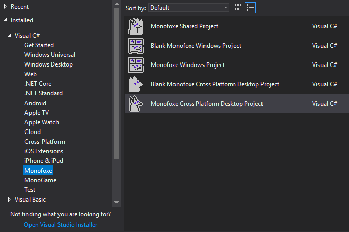

# Setting things up

*hehe, you are still here*

Well, it is time to install Monofoxe. Currently Monofoxe only supports development on Windows and Visual Studio, but it should be technically possible to make it run on other operating systems and IDEs. 

- Download Visual Studio 2017 [here](https://docs.microsoft.com/en-us/visualstudio/releasenotes/vs2017-relnotes). You can use 2019, but I recommend 2017, since 2019 is fairly new and not officially supported by Monogame yet.
- After installing Visual Studio and .NET Core package, download and install [latest Monofoxe release](https://github.com/Martenfur/Monofoxe/releases/latest). The installer already comes with Monogame, so you don't need to worry about it.

And that's pretty much it! Now you can open Visual Studio and there you'll see Monofoxe project templates.

## [<< Introduction](Introduction.md)	|	[Creating new project >>](CreatingNewProject.md)

[<<< Contents](Contents.md)

 

