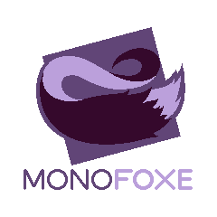

# What am I looking at?
This is Monofoxe - a game engine based on the [Monogame Framework](http://monogame.net). 
Its main goal is to greatly simplify working with Monogame and to provide basic set of tools 
enabling you to just *create a new project and make a damn game* without removing low-level access to the framework.
Monofoxe took a lot of inspiration from Game Maker, so it should be a bit familiar to some folks.

 [View changelog](/CHANGELOG.md)

[Download last stable release](https://github.com/Martenfur/Monofoxe/releases/latest)

[**View Docs**](Docs/README.md)

[**Join Monofoxe Discord**](https://discord.gg/F9tPYaD)

# What can it do?

Everything Monogame does, plus:

* Graphics pipeline and automated batch\vertex buffer management.
* Easy animation from sprite sheets.
* Texture packing.
* Sprite groups and dynamic graphics loading.
* Input management.
* Useful math for collisions and other game stuff.
* Timers, alarms, cameras, state machines, tilemaps, foxes!
* FMOD audio support (As a standalone [library](https://github.com/Martenfur/ChaiFoxes.FMODAudio/)).
* Hybrid EC.
* Scene system (with layers!).
* Tiled maps support.
* Enhanced content management via [Nopipeline](https://github.com/Martenfur/Nopipeline).

Coming in the future:

* Animated tiles and infinite tilemaps from Tiled.
* Particle system.
* Documentation.

# Can I use it in my p...

Yes, you can. Monofoxe is licensed under MPL 2.0, so you can use it and its code in any shenanigans you want. Free games, commercial games, your own the-coolest-in-the-world engines - no payment or royalties required. Just please leave a credit. ; - )
(Though, if you will be using FMOD, it has its own [license](https://fmod.com/licensing#faq), which is much less permissive than mine.)

# Should I use it?

Well, up to you. Currently I am developing Monofoxe alone, and can't really provide huge support, or anything. This is mostly an engine for myself and my games - I am not naive enough to think, that everyone will suddenly rush and drop Unity/Game Maker/whatever in favor of Monofoxe. But you can try. ( - :

# How do I use it?

Download the Monofoxe installer from the [latest release](https://github.com/Martenfur/Monofoxe/releases/latest). Installer bundles Visual Studio 2017 and 2019 templates. Monofoxe is distributed via nugets, so templates aren't mandatory. It's also a good idea to install project templates for [Monogame](https://github.com/MonoGame/MonoGame/releases/latest).

Just install Monofoxe, create Monofoxe project and you're good to go. 

**NOTE:** Due to VS2019 project search being completely broken, templates may not appear in the search right away. Instead of searching select "Monofoxe" in `Project Types`.

You can also check out the [basic feature demos](Monofoxe.Playground/) or the [Docs](Docs/README.md) to learn how to use Monofoxe.

# I've suddenly started loving foxes and want to contribute

That's the spirit. Check out if I need any help on my [Quire board](https://quire.io/w/Monofoxe/?board=Monofoxe). Stuff under `Open for taking` category is, well, open for taking. You can also contact me via email (`chaifoxes@gmail.com`), on [Twitter](https://twitter.com/ChaiFoxes) or on [Discord](https://discord.gg/F9tPYaD).

**Don't forget to check out Codestyle.cs before contributing!!!**

## Foxes who helped

- [MirrorOfSun](https://github.com/MirrorOfSUn)
- [Shazan](https://bitbucket.org/%7B07c29368-d971-4ab1-8ec5-1a89d56bfa43%7D/)

*don't forget to pet your foxes*