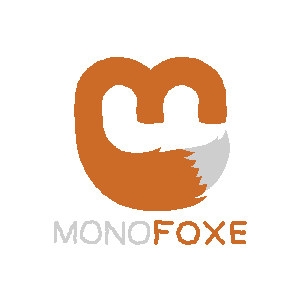

# What am I looking at?
This is Monofoxe - a game engine based on [Monogame Framework](http://monogame.net). 
Its main goal is to greatly simplify working with Monogame and provide basic set of tools 
enabling you to just *create a new project and make a damn game* without removing low-level access to the framework.
Monofoxe took a lot of inspiration from Game Maker, so it should be a bit familiar to some folks.

**Current state: pre-release**

# What can it do?

Everything Monogame does, plus:

* Graphics pipeline and automated batch\vertex buffer management.
* Easy animation from sprite sheets.
* Texture packing.
* Sprite groups and dynamic graphics loading.
* Input management.
* Useful math for collisions and othe game stuff.
* Timers, alarms, cameras, state machines, tilemaps, foxes!
* FMOD support (Windows-only for now).
* Hybrid ECS.
* Scene system (with layers!).
* Tiled maps support.

Coming in the future:

* Animated tiles and inifinite tilemaps from Tiled.
* Particle system.
* Linux\Android support for FMOD.
* Documentation.
* Demo game.

Not planned:

* 3D toolset.
* iOS\MacOS support for FMOD.
* Scripting.

# Can I use it in my p...

Yes, you can. Monofoxe is licensed under MPL 2.0, so you can use it in any shenanigans you want. Free games, commercial games, your own the-coolest-in-the-world engines - no payment or royalties required. Just please leave a credit. ; - )

# Should I use it?

Well, up to you. Currently I am developing Monofoxe alone, and can't really provide huge support, or anything. This is mostly an engine for myself and my games - I am not naive enough to think, that everyone will suddenly rush and drop Unity/Game Maker/whatever in favor of Monofoxe. But you can try. ( - :

# How do I use it?

You'll need:

* [Monogame](http://monogame.net).
* Latest release of Monofoxe as [Visual Studio templates (VERY outdated)](https://bitbucket.org/gnFur/monofoxe/downloads/MonofoxeDesktopGL.zip) or standalone libraries (coming soon!).

Just install Monofoxe template, create Monofoxe project and you're good to go.

# Do I need any special software?
Monofoxe has no external software dependencies except Monogame. 

Want to contribute, suggest a feature or just want to pour shit on my code? Feel free to contact me via email: chaifoxes@gmail.com or on [Twitter](https://twitter.com/ChaiFoxes).

*don't forget to pet your foxes*
